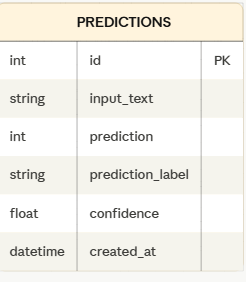

# Projet Machine Learning - Prédiction du départ des employés

## Objectif
Prédire si un employé va quitter l'entreprise à partir de données RH via une API FastAPI déployée en production.

---

## Structure du projet

```
Premier_projet04/
├── api/
│   └── main.py           # API FastAPI + connexion BDD
├── data/                 # Données sources CSV
├── docs/
│   └── schema_bdd.png    # Schéma UML de la base de données
│   └── examples.json     # Exemples JSON pour tester l'API
├── models/
│   └── modele_final_optimise.pkl  # Modèle entraîné
├── notebooks/            # Analyse et modélisation
├── src/
│   ├── database.py       # Connexion PostgreSQL + modèle ORM
│   ├── model.py          # Chargement du modèle ML
│   ├── predict.py        # Logique de prédiction
│   ├── preprocessing.py  # Prétraitement des données
│   └── load_dataset.py   # Insertion du dataset en base
└── tests/
    └── test_api.py       # Tests unitaires et fonctionnels
```

---

## Données
Les données proviennent de plusieurs sources RH fusionnées :

| Fichier | Description |
|---|---|
| `dataset_fusionne_complet.csv` | Dataset principal — 1 470 employés |
| `extrait_eval.csv` | Évaluations des employés |
| `extrait_sirh.csv` | Données SIRH |
| `extrait_sondage.csv` | Résultats sondages satisfaction |

---

## Modèle de Machine Learning

### Algorithme
- **Algorithme** : Random Forest Classifier
- **Optimisation** : GridSearchCV (72 combinaisons, 3 folds)
- **Fichier** : `models/modele_final_optimise.pkl`

### Meilleurs paramètres (GridSearchCV)
```
class_weight     : {0: 1, 1: 10}
max_depth        : 10
min_samples_leaf : 5
```

### Performances du modèle final

| Modèle | Accuracy | Precision (Oui) | Recall (Oui) | F1-Score (Oui) |
|---|---|---|---|---|
| Dummy (baseline) | 0.714 | 0.122 | 0.128 | 0.125 |
| Logistic Regression | 0.762 | 0.368 | 0.681 | 0.478 |
| Random Forest initial | 0.833 | 0.400 | 0.085 | 0.140 |
| **Random Forest optimisé** | **0.820** | **0.430** | **0.490** | **0.460** |
| RF avec seuil optimal (0.377) | 0.770 | 0.477 | 0.617 | **0.537** |

### Top 5 features importantes
1. `revenu_mensuel` — 7.8%
2. `age` — 6.3%
3. `annee_experience_totale` — 5.2%
4. `annees_dans_l_entreprise` — 5.2%
5. `heure_supplementaires` — 5.0%

### Justification des choix techniques
- **Random Forest** : robuste aux données déséquilibrées, interprétable via feature importance, pas besoin de normalisation
- **GridSearchCV** : recherche exhaustive des hyperparamètres pour maximiser le F1-Score
- **class_weight** : gestion du déséquilibre (16% de départs vs 84% de non-départs)

---

## Base de données

L'API utilise **PostgreSQL** via **SQLAlchemy** pour enregistrer automatiquement chaque prédiction.

### Schéma UML



### Tables

| Table | Description |
|---|---|
| `predictions` | Historique de toutes les prédictions |
| `employee_attrition` | Dataset complet — 1 470 employés |

### Structure de la table `predictions`

| Colonne | Type | Description |
|---|---|---|
| id | INTEGER PK | Clé primaire auto-incrémentée |
| input_text | TEXT | Données d'entrée JSON |
| prediction | INTEGER | 0 = reste, 1 = part |
| prediction_label | VARCHAR | "Ne partira pas" / "Va partir" |
| confidence | FLOAT | Score de confiance du modèle |
| created_at | DATETIME | Horodatage de la prédiction |

### Initialisation de la base
```bash
python src/database.py
```

### Insérer le dataset
```bash
python src/load_dataset.py
```

### Consulter l'historique
```
GET http://127.0.0.1:8001/predictions
```

---

## Installation

```bash
git clone https://github.com/Antoissymed/Premier_projet04.git
cd Premier_projet04

python -m venv venv
venv\Scripts\activate

pip install -r requirements.txt
```

---

## API FastAPI

### Lancer l'API

```bash
uvicorn api.main:app --reload --port 8001
```

### Documentation interactive (Swagger)
```
http://127.0.0.1:8001/docs
```

### Endpoints

| Méthode | Endpoint | Description |
|---|---|---|
| GET | `/` | Statut de l'API |
| GET | `/health` | Vérification santé |
| POST | `/predict` | Faire une prédiction |
| GET | `/predictions` | Historique des prédictions |

### Exemple d'appel

```json
POST /predict
{
  "satisfaction_employee_environnement": 3,
  "note_evaluation_precedente": 3,
  "niveau_hierarchique_poste": 2,
  "satisfaction_employee_nature_travail": 4,
  "satisfaction_employee_equipe": 3,
  "satisfaction_employee_equilibre_pro_perso": 3,
  "eval_number": "E_1",
  "note_evaluation_actuelle": 3,
  "heure_supplementaires": "Non",
  "augementation_salaire_precedente": "5%",
  "age": 35,
  "genre": "M",
  "revenu_mensuel": 4500,
  "statut_marital": "Célibataire",
  "departement": "Consulting",
  "poste": "Cadre Commercial",
  "nombre_experiences_precedentes": 3,
  "nombre_heures_travailless": 160,
  "annee_experience_totale": 8,
  "annees_dans_l_entreprise": 5,
  "annees_dans_le_poste_actuel": 2,
  "nombre_participation_pee": 1,
  "nb_formations_suivies": 2,
  "nombre_employee_sous_responsabilite": 0,
  "distance_domicile_travail": 10,
  "niveau_education": 4,
  "domaine_etude": "Infra & Cloud",
  "ayant_enfants": "Non",
  "frequence_deplacement": "Occasionnel",
  "annees_depuis_la_derniere_promotion": 2,
  "annes_sous_responsable_actuel": 3
}
```

### Exemple de réponse

```json
{
  "prediction": 0,
  "prediction_label": "Ne partira pas",
  "confidence": 0.55
}
```

---

## Tests

```bash
pytest -v
pytest --cov=api --cov-report=term-missing
```

---

## CI/CD

Le pipeline GitHub Actions s'exécute automatiquement à chaque push :
- Installation des dépendances
- Exécution des tests Pytest
- Rapport de couverture

Fichier : `.github/workflows/ci.yml`

---

## Technologies utilisées

| Technologie | Rôle |
|---|---|
| Python | Langage principal |
| FastAPI | Framework API |
| Scikit-learn | Modèle Random Forest |
| Pandas | Manipulation des données |
| PostgreSQL | Base de données production |
| SQLAlchemy | ORM — interaction avec la BDD |
| Pytest | Tests unitaires et fonctionnels |
| GitHub Actions | CI/CD automatisé |
| Swagger/OpenAPI | Documentation API intégrée |

---

## Protocole de mise à jour

1. Réentraîner le modèle avec de nouvelles données
2. Évaluer les performances (F1-Score cible > 0.50)
3. Remplacer `models/modele_final_optimise.pkl`
4. Mettre à jour les tests et la documentation
5. Pusher sur GitHub — le CI/CD valide automatiquement

---

## Auteur

**Antoissymed** — Projet de déploiement Machine Learning
Formation OpenClassrooms - Data Science